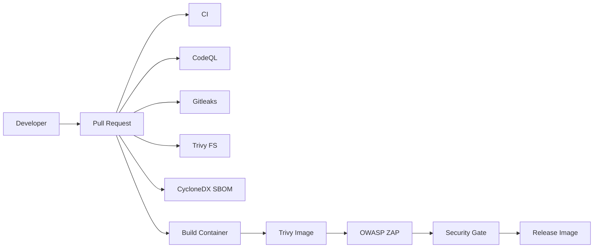

# Secure CI/CD Platform

A GitHub-native DevSecOps reference project that demonstrates how to make security a release gate instead of a post-deployment activity.


## What this project demonstrates

- TypeScript application engineering
- Unit and integration testing
- SAST with GitHub CodeQL
- Secret detection with Gitleaks
- Dependency and filesystem scanning with Trivy
- Container vulnerability scanning with Trivy
- SBOM generation with CycloneDX
- DAST with OWASP ZAP
- Security gates in pull requests
- Signed/releasable container workflow foundations
- Reproducible security-failure scenarios

## Architecture



## Design principle

The default branch is intended to stay **green and secure**. Intentional vulnerabilities live in `training/scenarios/` and are introduced through documented challenge changes. This lets a reviewer see both successful controls and controlled failures without keeping known vulnerable production code in the main branch.

## GitHub-first usage

1. Create the repository on GitHub.
2. Push this project.
3. Open **Actions** and confirm the CI and Security Gate workflows run.
4. Open a pull request for one of the training scenarios.
5. Review the failing control, remediate the change, and watch the pull request return to green.
6. Create a `v1.0.0` tag to exercise the container release workflow.

No local toolchain is required for the normal demonstration path; GitHub-hosted runners perform the checks. The container release workflow uses GitHub OIDC with Cosign so released images can be verified without a long-lived signing key.

## Security controls

| Control | Tool | Purpose |
|---|---|---|
| SAST | CodeQL | Find data-flow and code-level vulnerabilities |
| Secret scanning | Gitleaks | Detect leaked credentials in history/content |
| SCA | Trivy | Detect vulnerable dependencies and misconfiguration |
| Container scan | Trivy | Scan OS packages and application libraries |
| SBOM | CycloneDX | Produce machine-readable software inventory |
| DAST | OWASP ZAP | Exercise the running HTTP application |
| CI | GitHub Actions | Automate quality and security gates |

## Training scenarios

See `training/scenarios/README.md`. Each scenario is deliberately isolated from the secure baseline.

## Repository structure

```text
secure-cicd-platform/
├── src/
├── tests/
├── deploy/
├── scripts/
├── training/scenarios/
├── docs/
├── .github/workflows/
├── Dockerfile
├── docker-compose.yml
└── README.md
```

## Safe-use statement

This repository is an educational DevSecOps project. Security failures are intentionally introduced only in isolated training scenarios. Do not reuse demo credentials or deploy the training changes to production.
